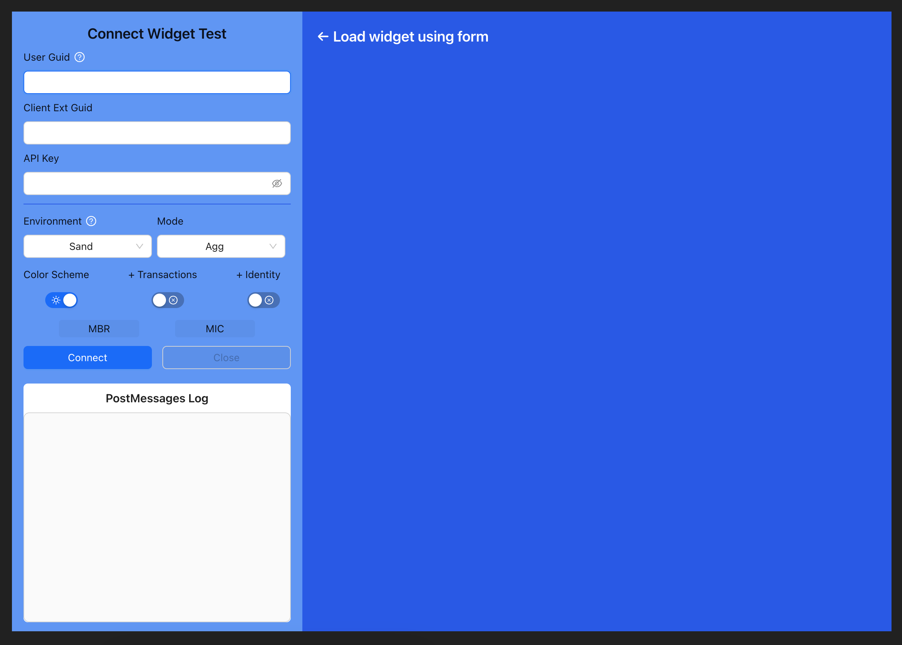
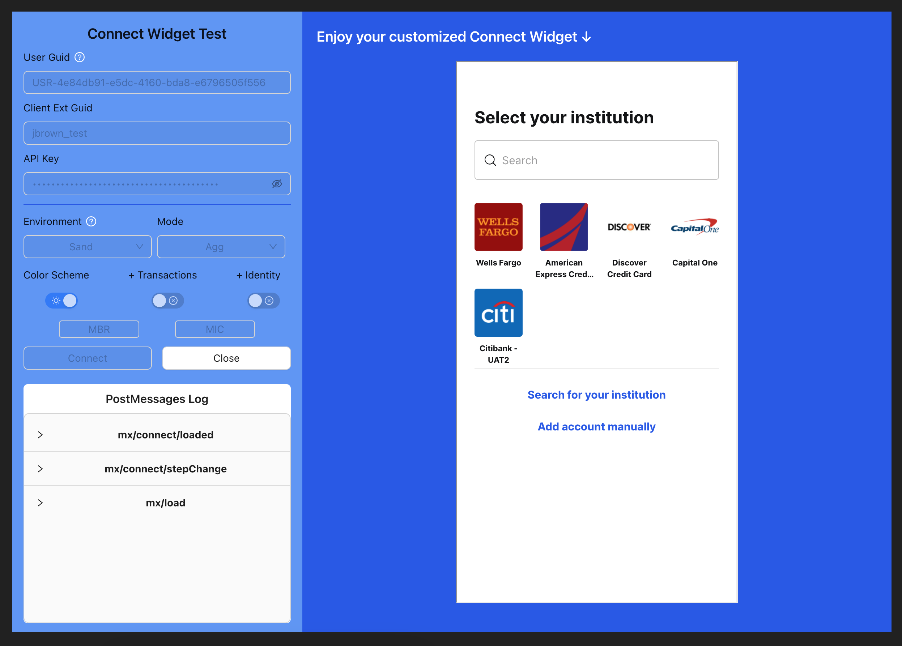

# Connect Widget Product Tool

This is a simple tool for the Product Team to make it easier to test the Connect Widget.

**This tool supports the following:**

- Light/Dark Mode
- PostMessages Log
- Custom `mode` value
- Users auto save for quick access
- Supports `include_*` config flags
- `SAND`, `QA`, and `INT` environments
- Setting current Member and Microdeposit guid
- Set locale/language for widget. `en`(English), `es`(Spanish), or `fr-CA`(French Canadian)

**Future features:**

- Support to config with products array
- Support to disable search

## Prerequisites

- Node.js 18+
- npm 9+

> You can check if you have these installed by running `node -v` and `npm -v`.  
> If you do not see a version on both, follow the instructions [here](#installing-node-and-npm).

## How to use

1. Clone the repo
2. Run `npm install`
3. Run `npm run dev`

## How to test

1. Open the [Connect Widget Product Tool](http://localhost:5173/) in your browser
2. Enter your test user's details and click **"Connect"**
3. The widget will load and you can test the Connect Widget
4. _PostMessages_ will log in side menu(newest at top)
5. Click **"Close"** to clear the widget and start over

## Form Values

- `userGuid` - Your test user guid
- `clientExtGuid` - Your test client external guid
- `apiKey` - Your test accessor's API key
- `environment` - The environment of your test user:
  - `SAND`
  - `QA`
  - `INT`
- `mode` - The mode of the widget:
  - Agg (`AGGREGATION`)
  - Verify (`VERIFICATION`)
- `locale` - The locale/language of the widget:
  - English (`en`)
  - Spanish (`es`)
  - French Canadian (`fr-CA`)
- `colorScheme` - The color scheme of the widget:
  - Light - `ON`
  - Dark - `OFF`
- `includeTransactions` - The color scheme of the widget:
  - Include - `ON`
  - Don't Include - `OFF`
- `includeIdentity` - The color scheme of the widget:
  - Include - `ON`
  - Don't Include - `OFF`
- `MBR` - The member to load the widget to.
- `MIC` - The microdeposit to load the widget to(*verification mode only*).

## Installling Node and NPM

### Using Volta(preferred)

1. Open a terminal and run `curl https://get.volta.sh | bash`.
1. Once complete, run `volta install node`.
1. Confirm Node is installed by opening a terminal and running `node -v` and `npm -v`. The terminal will output the current version of Node and npm that’s installed.

### From Node Directly

1. To install Node on macOS, open up a browser and navigate to [the official Node website](https://nodejs.org/?ref=ghost.org).
1. Click on the LTS version on the left and download the installer.
1. Run the installer, choosing the default options.
1. Confirm Node is installed by opening a terminal and running `node -v` and `npm -v`. The terminal will output the current version of Node and npm that’s installed.

## Questions/Comments

[Gitlab: @jameson13b](https://github.com/jameson13b)  
[Website: www.jamesonb.com](https://www.jamesonb.com)
